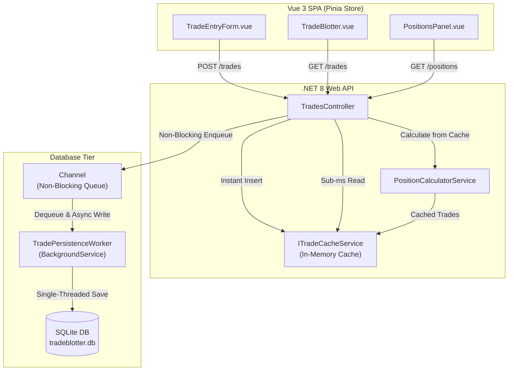

# Trade Blotter Application

A full-stack, real-time Trade Blotter application enabling financial traders to execute trades, view a scannable live trade blotter, and observe dynamically calculated position summaries and weighted average execution costs.

---

## 🏗️ Architecture & Technology Stack

### Backend Tier (.NET 8 Web API)
- **Framework**: C# / .NET 8 Web API
- **In-Memory Trade Cache (`ITradeCacheService`)**: Holds current day's trades in memory (`ConcurrentBag<Trade>`) for sub-millisecond `GET /trades` and `GET /positions` responses with zero database disk I/O hits.
- **Concurrent Queue Persistence (`Channel<Trade>`)**: Non-blocking in-memory queue (`System.Threading.Channels.Channel<Trade>`) that decouples HTTP request latency from disk write operations.
- **Asynchronous Background Worker (`TradePersistenceWorker`)**: Single-threaded `BackgroundService` that dequeues trades and persists them asynchronously to SQLite, eliminating database file locking and write contention.
- **Database**: SQLite (`tradeblotter.db`) via Entity Framework Core.
- **Testing**: xUnit unit test suite covering single buys, mixed trades, short positions, and net zero position omission.

### Frontend Tier (Vue 3 + Pinia + Vite)
- **Framework**: Vue 3 (Composition API) + TypeScript
- **State Management**: Pinia (`useTradeStore`)
- **Build Tool**: Vite
- **UI Components**:
  - **Trade Entry Form**: Real-time client-side validation (non-empty symbol, positive quantity, positive price), side toggle (BUY/SELL), and input auto-clearing.
  - **Trade Blotter Table**: Reverse-chronological trade execution grid with visual BUY (Emerald) and SELL (Crimson) badges, calculated Notional Value (`Quantity * Price`), and interactive column header sorting.
  - **Positions Panel**: Reactive table displaying Net Quantity (supporting Long and Short positions) and weighted Average Cost per symbol. Net zero positions are automatically omitted.

---

## 🚀 How to Run Locally

### Prerequisites
- [.NET 8 SDK](https://dotnet.microsoft.com/download/dotnet/8.0) (or .NET 9/10 SDK)
- [Node.js](https://nodejs.org/) (v18+ recommended) and `npm`

---

### Step 1: Run the Backend (.NET 8 Web API)

Open a terminal at the project root directory and run:

```bash
dotnet run --project src/TradeBlotter.Api/TradeBlotter.Api.csproj --urls http://localhost:5000
```

The Web API will initialize the SQLite database (`tradeblotter.db`), seed the in-memory trade cache for today's trades, start the background persistence worker, and listen on `http://localhost:5000`.

#### API Endpoints
- `POST /trades`: Submit a new trade (Enqueues to cache & queue, returns `201 Created`).
- `GET /trades`: Fetch today's executed trades (Served from in-memory cache).
- `GET /positions`: Fetch derived net positions and weighted average costs.

---

### Step 2: Run the Frontend (Vue 3 + Vite)

Open a second terminal window and navigate to `src/TradeBlotter.Web`:

```bash
cd src/TradeBlotter.Web
npm install
npm run dev
```

Open your browser and navigate to **`http://localhost:5173`**.

---

## 🧪 Running Unit Tests

Run the xUnit test suite to verify position calculation math and short position logic:

```bash
dotnet test src/TradeBlotter.slnx
```

---

## 📊 Data Flow & System Design



Detailed architecture flowcharts and sequence diagrams can be found in [`docs/system-design-flow.md`](./docs/system-design-flow.md).

---

## 💡 Key Design Decisions & Assumptions

1. **Positions Are Derived, Not Persisted**:
   - Per requirements, position summaries are calculated dynamically on demand from trade execution history and never persisted separately in the database.
2. **Short Positions Are Supported**:
   - Selling shares without prior buy trades or selling more than held long quantity produces a Short position ($\text{NetQty} < 0$).
   - Weighted average cost tracks average short entry price for short positions, and position flips (Short $\leftrightarrow$ Long) update average cost seamlessly.
3. **Net Zero Position Omission**:
   - Symbols with a net quantity of zero ($\text{NetQty} == 0$) are omitted from position API responses.
4. **In-Memory Cache & Concurrent Queue**:
   - Isolates API HTTP request threads from SQLite disk file locks and provides sub-millisecond read responses for blotter and positions views.

---

## 🔮 Future Scalability & Enhancements

Given additional development time, the following production enhancements would be added:
- **SignalR WebSockets**: Push real-time trade execution notifications to multiple connected client blotters without REST polling.
- **Distributed Cache & Queue**: Upgrade in-memory cache and `Channel<T>` to Redis and Apache Kafka for horizontal multi-node scaling across 20,000+ concurrent connections.