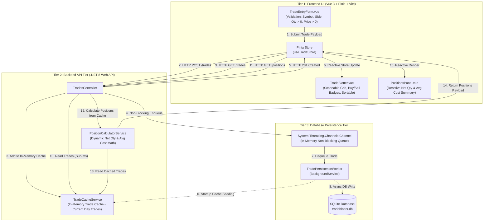
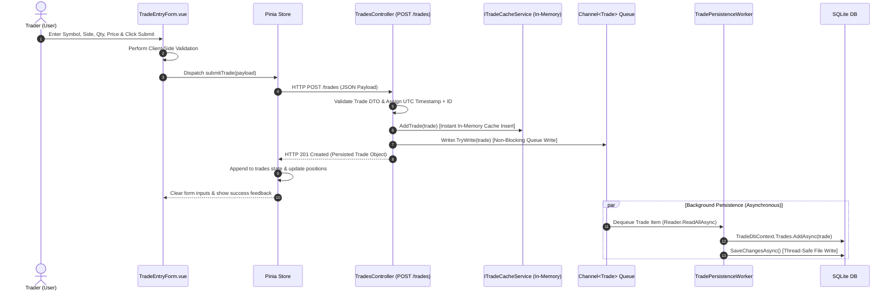
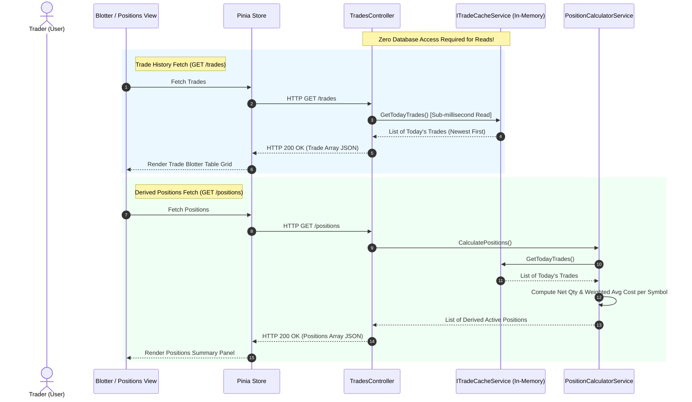

# System Architecture & Data Flow Diagram

This document outlines the full-stack system architecture and data flow for the Trade Blotter Application, highlighting the non-blocking API tier, in-memory trade cache, concurrent database queue persistence, dynamic position derivation logic, and reactive Vue 3 frontend components.

---

## 1. High-Level End-to-End Data Flow

---

## 2. Trade Submission & In-Memory Caching Sequence

---

## 3. Fast Read Requests Sequence (GET /trades & GET /positions)

---

## 4. Component Responsibility Matrix

| Tier | Component | Responsibilities |
| :--- | :--- | :--- |
| **Frontend UI** | `TradeEntryForm.vue` | Input capture, client validation (positive qty/price), submit triggering. |
| **Frontend UI** | `TradeBlotter.vue` | Displaying reverse-chronological trade history with visual Buy/Sell badges, notional value formatting (`Qty * Price`), and column header sorting. |
| **Frontend UI** | `PositionsPanel.vue` | Displaying reactive net positions, long/short indicators, and average execution costs per active symbol. |
| **Frontend UI** | `useTradeStore` (Pinia) | Centralized state management, API HTTP communication, and reactive store state updates. |
| **Backend API** | `TradesController` | REST endpoints (`POST /trades`, `GET /trades`, `GET /positions`), DTO validation, cache integration, queue submission. |
| **Backend API** | `ITradeCacheService` | In-memory thread-safe cache (`ConcurrentBag<Trade>` / `ConcurrentQueue<Trade>`) holding current day's trades for instant sub-millisecond reads. |
| **Backend API** | `PositionCalculatorService` | Dynamic derivation of net quantity and weighted average cost for long ($\text{NetQty} > 0$) and short ($\text{NetQty} < 0$) positions directly from cached trades. |
| **Database Tier** | `System.Threading.Channels.Channel<Trade>` | Thread-safe in-memory concurrent channel separating HTTP requests from disk write latency. |
| **Database Tier** | `TradePersistenceWorker` | `BackgroundService` executing single-threaded sequential writes to SQLite DB to prevent database file locking. |
| **Database Tier** | SQLite (`tradeblotter.db`) | Durable relational database store for trade records. |
